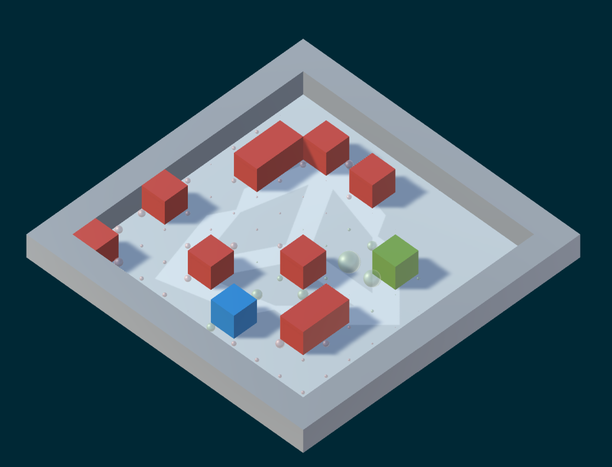

# Q-GridWorld Demo

Simple Unity project demonstrating the Q-learning algorithm in a tabular setting. For an in-browser WebGL version, follow the link [here](http://awjuliani.github.io/GridGL/). 

## Overview

In the simplest scenario, we have a 5x5 grid world with an agent (blue block), a goal (green block) and obstacles (red blocks). For each run of the demo, the positions of the agent, goal and obstacles are all selected at random (but remain consistent throughout the same demo run). In this grid world setting, the goal of the agent is to learn a strategy to navigate from its start position to the goal position efficiently while avoiding obstacles. It achieves this by learning the best action to take for every state it is in (typically called a *policy* in reinforcement learning). An action here is a direction to move (north, south, east and west), while a state here is its position in the grid world. It essentially learns the shortest, obstacle-free path from its start position to the goal position. 

The Q-learning algorithm implemented here learns the policy by maintaining a numeric value for each action-state pair that represents how favourable it is to take a specific action when in a specific state. This numeric value for every action-state pair is incrementally updated as the agent explores the grid world. Intuitively, it performs several trials, where a trial is a series of actions that either end at an obstacle or the goal position. Then for each action-state pair it performed throughout the trial it increments its value if it were a positive trial (ended in the goal position), and decrements its value if it were a negative trial (collided with an obstacle). The agent is also given a small negative reward for each step it takes to encourage it to discover the shortest path.

Similar to our earlier [multi-armed bandit demo](https://github.com/Unity-Technologies/BanditDungeon), there is an exploration-exploitation trade-off here. When the agent is running through a trial it mixes between randomly picking actions and following its current guess of the best action to take when in a given state. This trade-off is controlled by an epsilon parameter that begins at 1 (encouraging full exploration) and throughout the trials is slowly decremented to 0.1 (limiting exploration). Consequently, as you run the demo you will notice that as the demo goes on, and the epsilon value declines, the agents actions become more and more predictable, converging to the optimal path from its start position to the goal position.

For more information on how the agent learns the strategy, check out our [corresponding post](https://blogs.unity3d.com/2017/08/22/unity-ai-reinforcement-learning-with-q-learning/) in the [Unity AI blog](https://unity3d.ai).

Beyond this demo, check out our [Unity ML Agents repo](https://github.com/Unity-Technologies/ml-agents) which contains an SDK for applying more advanced methods to training behaviors within Unity.

## In-game Settings

The goal of this Unity project is to provide an informative visualization for the Q-learning algorithm, enabling you to explore several grid sizes: small (5x5), medium (10x10) and large (15x15). Once you run the project, a demo will automatically start for the medium grid size, but you can change the grid size and click the *Start New Environment* button at any time.

## Set-up

To get started with this project:
* [Download and install Unity](https://unity3d.com/get-unity/download) if you don't already have it. 
* Download or clone this GitHub repository.
* Open the game.unity file under the Assets/ subdirectory. 

Within the project:
- `InternalAgent.cs` contains all of the Q-learning logic. 
- `GridEnvironment.cs` contains all of the environment-specific logic.
